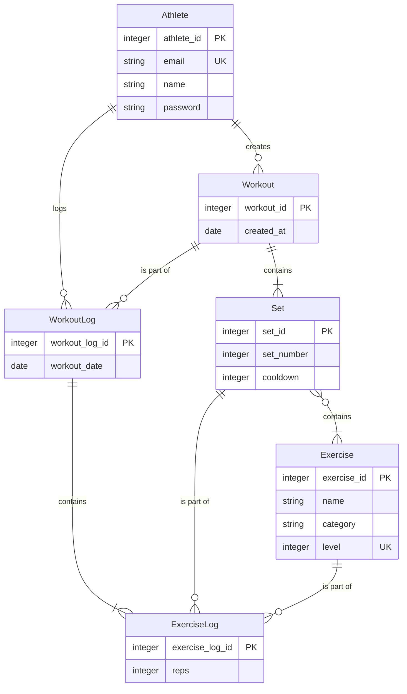

# Calisthenics PWA

Calisthenics circuit workout

## ER-diagram

```mermaid
erDiagram
  Athlete {
    integer athlete_id PK
    string email UK
    string name
    string password
  }
  Workout {
    integer workout_id PK
    date created_at
  }
  Set {
    integer set_id PK
    integer set_number
    integer cooldown
  }
  Exercise {
    integer exercise_id PK
    string name
    string category
    integer level UK
  }
  WorkoutLog {
    integer workout_log_id PK
    date workout_date
  }
  ExerciseLog {
    integer exercise_log_id PK
    integer reps
  }

  Athlete ||--o{ Workout : "creates"
  Workout ||--|{ Set : "contains"
  Set }o--|{ Exercise : "contains"
  Athlete ||--o{ WorkoutLog : "logs"
  Workout ||--o{ WorkoutLog : "is part of"
  WorkoutLog ||--|{ ExerciseLog : "contains"
  Set ||--o{ ExerciseLog : "is part of"
  Exercise ||--o{ ExerciseLog : "is part of"
```
